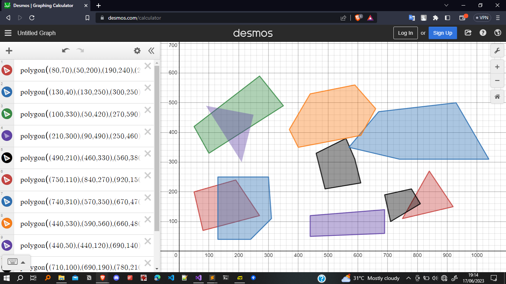

# Area of Polygons 



## Output:

```
	Area of the polygon:SHAPE1 = 23100
	----------------------------
	Area of the polygon:SHAPE2 = 34650
	----------------------------
	Area of the polygon:SHAPE3 = 33050
	----------------------------
	Area of the polygon:SHAPE4 = 13400
	----------------------------
	Area of the polygon:SHAPE5 = 16750
	----------------------------
	Area of the polygon:SHAPE6 = 11800
	----------------------------
	Area of the polygon:SHAPE7 = 62550
	----------------------------
	Area of the polygon:SHAPE8 = 40200
	----------------------------
	Area of the polygon:SHAPE9 = 18750
	----------------------------
	Area of the polygon:SHAPE10 = 7650
	----------------------------
	Overlapping shape pairs:
	SHAPE1 overlaps with SHAPE2
	SHAPE4 overlaps with SHAPE3
	SHAPE7 overlaps with SHAPE5
	SHAPE10 overlaps with SHAPE6
	SHAPE8 overlaps with SHAPE7

```